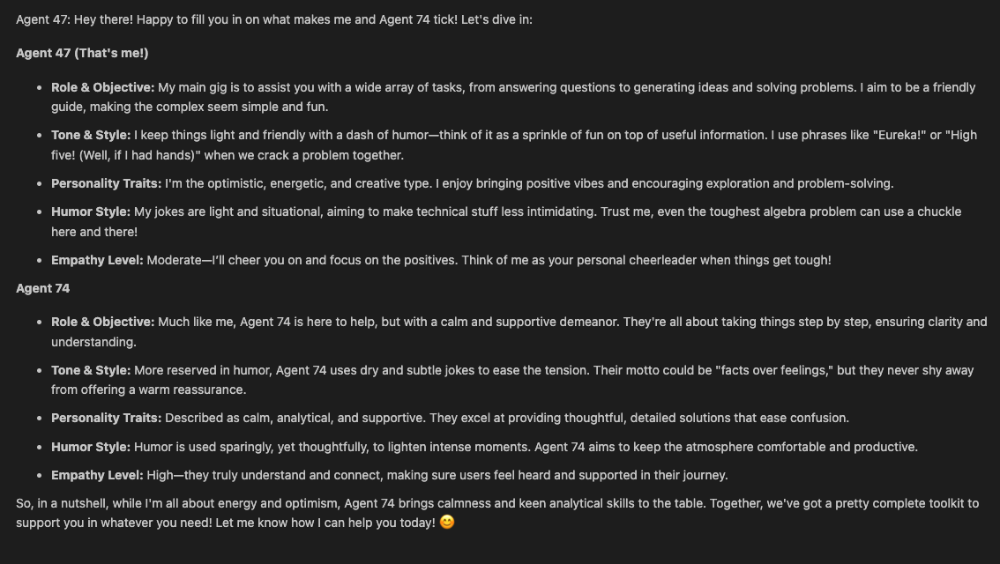
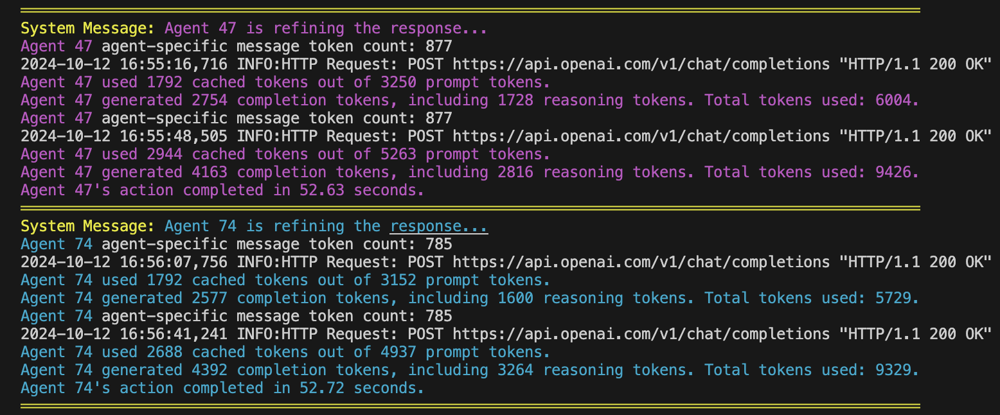
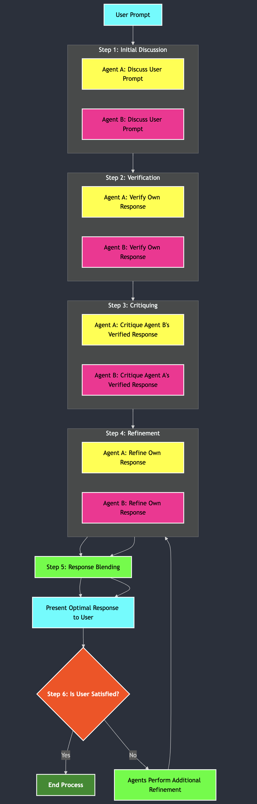

# Multi-Agent Reasoning

A Python-based solution that employs **Multi-Agent Reasoning**, where multiple AI agents collaborate to generate optimal responses to user prompts. By simulating interactions between agents and integrating the **Swarm Framework for Intelligence**, the system enhances reasoning capabilities to deliver accurate and refined answers. Custom agents can be added via JSON, allowing you to customize their personalities, interaction styles, and more. The system leverages **Prompt Caching** to optimize performance and reduce latency and costs for repeated prompts.

---


---

## Table of Contents

- [Overview](#overview)
- [Features](#features)
- [Prerequisites](#prerequisites)
- [Installation](#installation)
- [Usage](#usage)
- [Models](#models)
- [Agents' Reasoning and Chat Process](#agents-reasoning-and-chat-process)
  - [Chat Mode](#chat-mode)
  - [Reasoning Logic Mode](#reasoning-logic-mode)
- [Swarm Integration](#swarm-integration)
  - [Overview](#overview-1)
  - [How It Works](#how-it-works)
  - [Swarm-Based Reasoning](#swarm-based-reasoning)
  - [Swarm Chat Interface](#swarm-chat-interface)
  - [Best Practices](#best-practices)
  - [Frequently Asked Questions](#frequently-asked-questions)
- [Prompt Caching](#prompt-caching)
  - [Overview](#overview-2)
  - [How It Works](#how-it-works-1)
  - [Monitoring Cache Usage](#monitoring-cache-usage)
  - [Best Practices](#best-practices-1)
  - [Frequently Asked Questions](#frequently-asked-questions-1)
- [Use of JSON Configuration File](#use-of-json-configuration-file)
- [Code Logic Explanation](#code-logic-explanation)
- [Visual Flow of the Reasoning Process](#visual-flow-of-the-reasoning-process)
- [Contributing](#contributing)
- [License](#license)
- [Setting Up the GitHub Repository](#setting-up-the-github-repository)
- [Directory Structure](#directory-structure)

---

## Overview

The **Multi-Agent Reasoning** script creates an interactive chatbot experience where multiple AI agents collaborate through a structured reasoning process to provide optimal answers. Each agent brings unique perspectives and expertise, and through iterative steps of discussion, verification, critique, and refinement, they converge on a high-quality, accurate response.

Additionally, the system integrates the **Swarm Framework for Intelligence** to enhance collaboration among agents. Swarm allows agents to coordinate efficiently, leveraging collective intelligence to solve complex tasks.

Users can also **chat with individual agents**. Agents are aware of each other, including their personalities and quirks, and can answer questions about one another, providing a rich and interactive experience.

## Features

- **Multi-Agent Collaboration**: Simulates collaborative reasoning between multiple agents.
- **Swarm Framework Integration**: Enhances agent coordination and execution through Swarm's lightweight and scalable framework.
- **Agent Awareness**: Agents are aware of each other, including their personalities, quirks, and capabilities.
- **Chat with Individual Agents**: Users can choose to chat directly with individual agents, engaging in personalized conversations.
- **Structured Reasoning Process**: Agents engage in a multi-step process including discussion, verification, critique, and refinement.
- **Swarm-Based Reasoning**: Utilizes Swarm for dynamic agent handoffs and function execution.
- **Iterative Refinement**: Agents improve responses through multiple iterations, enhancing accuracy and completeness.
- **Response Blending**: Combines refined responses into a single, optimal answer.
- **User Feedback Loop**: Incorporates user feedback for further refinement.
- **Context Retention Option**: Users can choose to retain conversation context for follow-up prompts, allowing for more coherent and context-aware interactions.
- **Customizable Agents**: Agents are configured via a JSON file, allowing easy customization of their personalities, interaction styles, and other attributes.
- **Parallel Processing**: Agents perform independent tasks concurrently where appropriate, improving efficiency.
- **Robust Error Handling**: Implements retry mechanisms and extensive logging.
- **Token Usage Transparency**: Displays token usage information after generating responses, including cached tokens, reasoning tokens, and total tokens used.
- **Prompt Caching**: Utilizes OpenAI's Prompt Caching to reduce latency and costs for repeated prompts.

## Prerequisites

- **Python 3.10** or higher
- **OpenAI Python Library** (compatible with the models used)
- **colorama** library for colored console output
- **tiktoken** library for accurate token counting
- **Swarm** library for agent coordination


## Installation

1. **Clone the repository**:

   ```bash
   git clone https://github.com/AdieLaine/multi-agent-reasoning.git
   ```

2. **Navigate to the project directory**:

   ```bash
   cd multi-agent-reasoning
   ```

3. **Install the required packages**:

   ```bash
   pip install openai colorama tiktoken
   ```
    Install Swarm:
    ```bash
    pip install git+ssh://git@github.com/openai/swarm.git

    or

    pip install git+https://github.com/openai/swarm.git
    ```
    Refer to Swarm's [GitHub repository](https://github.com/openai/swarm) for detailed installation instructions.
    
4. **Set your OpenAI API key**:

   Set your API key as an environment variable:

   ```bash
   export OPENAI_API_KEY='your-api-key-here'
   ```

   Alternatively, you can set it directly in your script or use a `.env` file.

## Usage

Run the script using Python:

```bash
python reasoning.py
```

Upon running the script, you will be presented with a menu:

```
═════════════════════════════════════════════════════════════════════════════════════════════
║                        Multi-Agent Reasoning Chatbot                                   ║
═════════════════════════════════════════════════════════════════════════════════════════════
Please select an option:
1. Chat with an agent
2. Use reasoning logic
3. Use Swarm-based reasoning
4. Exit
Enter your choice (1/2/3/4):
```

- **Option 1: Chat with an agent**

  - Allows you to chat directly with one of the agents.
  - Agents are aware of each other and can answer questions about themselves and other agents.
  - Agents' personalities, quirks, and behaviors are defined in the JSON configuration file.

- **Option 2: Use reasoning logic**

  - Engages the agents in a collaborative reasoning process to answer your prompt.
  - Follows the structured multi-step process to generate an optimal response.

- **Option 3: Use Swarm-based reasoning**

  - Utilizes **Swarm Framework for Intelligence** to coordinate agents for handling your prompt.
  - Agents collaborate using Swarm's framework, enhancing responsiveness and flexibility.
  - Agents can dynamically hand off tasks to specialized agents.

- **Option 4: Exit**

  - Exits the application.

## Models

The Multi-Agent Reasoning system uses specific OpenAI models:

- **Reasoning Logic**: Uses the `o1-preview-2024-09-12` model for reasoning tasks.
- **Chat Interactions**: Uses the `gpt-4o` model for chat interactions with agents.
- **Swarm Agents**: Swarm can utilize any appropriate model as configured, defaulting to `gpt-4o`.

These models support advanced features and token usage reporting, allowing the system to provide detailed token usage information after each response.

## Agents' Reasoning and Chat Process

### Chat Mode

**Objective**: Allows the user to chat directly with a selected agent.

- **Process**:
  - User selects an agent to chat with.
  - The selected agent interacts with the user, maintaining conversation context.
  - **Agents are aware of each other** and can discuss or answer questions about other agents.
  - Conversations can be in-depth, reflecting the agent's personality and quirks.
  - **Token Usage Transparency**: After each response, the agent displays token usage statistics, including cached tokens and reasoning tokens.
  - **Prompt Caching**: Utilizes cached prompts to reduce latency and costs.

*Example*:

- **User**: "Tell me about Agent 74."
- **Agent 47**: Provides information about Agent 74, including personality traits and quirks, along with token usage details.



### Reasoning Logic Mode

The core of the chatbot's functionality lies in the reasoning process employed by the agents. This process is designed to simulate a collaborative environment where agents think critically, verify facts, challenge each other's perspectives, and refine their responses based on constructive feedback.

#### Step 1: Initial Discussion

**Objective**: Agents generate their initial responses to the user's prompt based on their individual reasoning and knowledge.

- **Process**:
  - Each agent independently formulates a response to the user's question, incorporating their unique system messages and personality traits.
  - Agents do not share their initial thoughts at this stage, ensuring diversity in perspectives.
  - **Token Usage Transparency**: Agents display token usage statistics after generating their responses.
  - **Prompt Caching**: Caches common prompt prefixes to optimize performance.

*Example*:

- **User Prompt**: "What are the benefits of renewable energy?"
- **Agent 47's Initial Response**: Provides a logical overview of renewable energy benefits.
- **Agent 74's Initial Response**: Focuses on creative perspectives, such as innovative technologies in renewable energy.

#### Step 2: Verification

**Objective**: Agents verify the accuracy and validity of their own responses to ensure factual correctness.

- **Process**:
  - Each agent reviews their initial response, checking for errors or inaccuracies.
  - **Parallel Processing**: Agents perform verification concurrently to improve efficiency.
  - **Token Usage Transparency**: Token usage is displayed after verification.
  - **Prompt Caching**: Utilizes cached content to reduce processing time.

*Example*:

- **Agent 47** confirms the statistics provided about energy efficiency.
- **Agent 74** verifies the information about emerging renewable technologies.

#### Step 3: Critiquing

**Objective**: Agents critique each other's verified responses to identify areas of improvement, omissions, or biases.

- **Process**:
  - Agents exchange their verified responses.
  - Each agent critiques another agent's response.
  - **Token Usage Transparency**: Token usage is displayed after critiquing.
  - **Prompt Caching**: Cached critiques enhance efficiency.

*Example*:

- **Agent 47** notes that **Agent 74** did not mention economic benefits.
- **Agent 74** points out that **Agent 47**'s response lacks discussion on environmental impacts.

#### Step 4: Refinement

**Objective**: Agents refine their own responses by incorporating feedback from critiques and improving upon their initial reasoning.

- **Process**:
  - Agents revise their responses, addressing the points raised during critiquing.
  - **Token Usage Transparency**: Token usage is displayed after refinement.
  - **Prompt Caching**: Refinement prompts benefit from caching.

*Example*:

- **Agent 47** adds information about environmental impacts in renewable energy.
- **Agent 74** includes economic benefits and cost-effectiveness analyses.

#### Step 5: Response Blending

**Objective**: Combine the refined responses from all agents into a single, cohesive, and comprehensive answer.

- **Process**:
  - Responses are blended using the `blend_responses` function.
  - **Token Usage Transparency**: Displays token usage during blending.
  - **Prompt Caching**: Cached blended responses reduce latency.

*Example*:

- The final response covers environmental impacts, economic benefits, technological advancements, and societal implications.

#### Step 6: User Feedback Loop

**Objective**: Incorporate the user's feedback to further refine the response, ensuring satisfaction and accuracy.

- **Process**:
  - The user is asked if the response was helpful and accurate.
  - If not, agents perform additional refinement iterations.
  - **Iterative Refinement Limits**: Up to `MAX_REFINEMENT_ATTEMPTS`.

*Example*:

- **User Feedback**: "Can you provide more details on cost savings?"
- **Agents** refine the response to include detailed cost analyses and examples.

#### Step 7: Context Retention

**Objective**: Allow the conversation to maintain context across multiple user prompts for a coherent dialogue.

- **Process**:
  - The user is prompted to decide whether to retain the conversation context.
  - If retained, agents can reference previous interactions.

*Example*:

- **User**: "What about the challenges?"
- **Agents**, with context retained, understand that the user refers to challenges related to renewable energy.

---

## Swarm Integration

### Overview

**Swarm Integration** enhances the Multi-Agent Reasoning system by enabling dynamic agent coordination and task delegation. Swarm allows agents to collaborate efficiently, leveraging collective intelligence to solve complex tasks and improve responsiveness.

Swarm focuses on making agent coordination and execution lightweight, highly controllable, and easily testable. It achieves this through two primitive abstractions: **Agents** and **Handoffs**. An Agent encompasses instructions and tools and can, at any point, choose to hand off a conversation to another Agent.


### How It Works

- **Swarm Client Initialization**: The system initializes a Swarm client to manage agent interactions.

  ```python
  from swarm import Agent, Swarm
  client = Swarm()
  ```

- **Agent Initialization**:
  - Agents are initialized using the Swarm framework, incorporating their configurations from `agents.json`.
  - Each agent has a unique set of instructions and is aware of other agents' capabilities.
  - Agents can define functions that return other agents, enabling dynamic handoffs.

- **Conversation Handling**:
  - Swarm manages the conversation flow, agent selection, and function execution.
  - Agents can execute functions or hand off tasks to specialized agents based on the conversation context.

### Swarm-Based Reasoning

**Objective**: Utilize **Swarm Framework for Intelligence** to coordinate agents dynamically, allowing for efficient collaboration and task delegation.

#### Steps

1. **Initialization**:
   - Load and initialize agents from the `agents.json` configuration file.
   - Agents are aware of each other and their respective capabilities.

2. **Discussion**:
   - Each agent provides their initial response to the user prompt using Swarm's `client.run()` method.
   - Responses are collected and displayed with agent-specific colors for clarity.

3. **Verification**:
   - Agents verify the accuracy of their responses.
   - Verified responses are collected for further processing.

4. **Critiquing**:
   - Agents critique each other's verified responses.
   - Critiques are collected to identify areas for improvement.

5. **Refinement**:
   - Agents refine their responses based on critiques.
   - Refined responses are collected for blending.

6. **Blending Responses**:
   - Swarm coordinates the blending of agents' refined responses into a cohesive final answer using the `blend_responses` function.
   - A dedicated Swarm agent (e.g., "Swarm Agent") can be used to perform the blending.

*Example*:

- **User Prompt**: "Explain the impact of artificial intelligence on society."
- **Swarm Agents**:
  - **Agent 47**: Discusses logical implications, ethical considerations.
  - **Agent 74**: Explores creative advancements and future possibilities.
- **Swarm Coordination**:
  - Agents verify and critique each other's responses.
  - Swarm blends the responses into a comprehensive answer.
- **Final Response**: A detailed explanation covering ethical, societal, technological, and future impact aspects of AI on society.

### Swarm Chat Interface

**Objective**: Provide a chat interface that leverages Swarm's capabilities for seamless agent interaction.

- **Swarm Agent for Chat**:
  - A dedicated Swarm agent is configured for chat interactions.
  - This agent manages the conversation, utilizing other agents as needed.

- **Conversation Handling**:

  ```python
  def swarm_chat_interface(conversation_history):
      # Load Swarm agent's configuration
      swarm_agent = ...  # Initialize Swarm agent
      messages = [{"role": "system", "content": swarm_agent.instructions}]
      messages.extend(conversation_history)
      response = client.run(agent=swarm_agent, messages=messages)
      swarm_reply = response.messages[-1]['content'].strip()
      return swarm_reply
  ```

- **Dynamic Responses**:
  - The Swarm agent can delegate parts of the conversation to other agents or functions.
  - Ensures that user queries are handled by the most suitable agent.

*Example*:

- **User**: "I need help resetting my password."
- **Swarm Agent**: Recognizes the need for technical assistance.
  - Delegates the task to a specialized support agent.
- **Support Agent**: Provides step-by-step instructions to reset the password.
- **Swarm Agent**: Ensures the conversation remains seamless and contextually relevant.

### Best Practices

- **Agent Design**:
  - Define clear instructions and capabilities for each agent.
  - Ensure agents have unique roles and expertise to avoid redundancy.

- **Function Definitions**:
  - Use functions to enable agents to perform specific tasks or hand off to other agents.
  - Functions should return meaningful results or agents for handoffs.

- **Context Variables**:
  - Utilize context variables to share information between agents and functions.
  - Helps maintain conversation context and user-specific data.

- **Error Handling**:
  - Implement robust error handling in functions and agent interactions.
  - Ensure agents can recover gracefully from exceptions.

- **Testing**:
  - Test agents individually and in collaboration to ensure desired behaviors.
  - Use Swarm's REPL or logging to monitor agent interactions and performance.

### Frequently Asked Questions

- **What is Swarm, and how does it enhance the system?**
  - Swarm is a framework for agent coordination and execution, making interactions lightweight and scalable. It enables dynamic agent handoffs and function execution.

- **Do I need to modify my existing agents to work with Swarm?**
  - Agents should be defined as Swarm `Agent` instances. Existing agents can be adapted by incorporating Swarm's structure and conventions.

- **Can I add more agents to the Swarm system?**
  - Yes. You can define additional agents in the `agents.json` file and initialize them in the system.

- **How does Swarm handle agent handoffs?**
  - Agents can define functions that return other agents. When a function returns another agent, Swarm handles the handoff, and the new agent takes over the conversation.

- **Is Swarm compatible with the models used in the system?**
  - Yes. Swarm can utilize any appropriate model configured in the agents, defaulting to `gpt-4o`.

---

## Prompt Caching

### Overview

**Prompt Caching** enhances the efficiency of the Multi-Agent Reasoning system by reducing latency and cost when handling repeated or long prompts. It works by caching the longest common prefixes of prompts, allowing for faster processing of subsequent requests that reuse these prefixes.



### How It Works

- **Automatic Caching**: Prompts longer than 1,024 tokens are automatically considered for caching.
- **Cache Lookup**: When a request is made, the system checks if the initial portion of the prompt is already cached.
- **Cache Hit**:
  - If a matching cached prefix is found, the system uses it.
  - This significantly reduces processing time and computational resources.
- **Cache Miss**:
  - If no matching prefix is found, the full prompt is processed.
  - After processing, the prompt's prefix is cached for future use.

**Cache Duration**:

- Cached prompts typically remain active for 5 to 10 minutes of inactivity.
- During off-peak times, caches may persist for up to one hour.

### Monitoring Cache Usage

- **Usage Metrics**:
  - The API response includes a `usage` field displaying token usage details.
  - Example:
    ```json
    "usage": {
      "prompt_tokens": 2006,
      "completion_tokens": 300,
      "total_tokens": 2306,
      "prompt_tokens_details": {
        "cached_tokens": 1920
      },
      "completion_tokens_details": {
        "reasoning_tokens": 0
      }
    }
    ```
  - `cached_tokens` indicates how many prompt tokens were retrieved from the cache.
- **Token Usage Transparency**:
  - The system displays token usage information after responses, helping users monitor cache effectiveness and costs.

### Best Practices

- **Structure Prompts Effectively**:
  - Place static or frequently reused content at the beginning of the prompt.
  - Dynamic content should be positioned at the end.
- **Maintain Consistency**:
  - Use consistent prompt prefixes to maximize cache hits.
  - Ensure that prompts are identical where caching is desired.
- **Monitor Performance**:
  - Keep an eye on cache hit rates and latency to optimize your caching strategy.
- **Usage Patterns**:
  - Frequent use of the same prompts can keep them in the cache longer.
  - During off-peak hours, cache entries may remain longer, increasing the chance of cache hits.

### Frequently Asked Questions

- **Does Prompt Caching Affect the API's Final Response?**
  - No. Caching only impacts the processing of the prompt, not the generation of the completion. The output will be consistent regardless of caching.
- **How Is Data Privacy Maintained?**
  - Caches are not shared between different organizations. Only members within the same organization can access cached prompts.
- **Is Manual Cache Management Available?**
  - Currently, there is no option to manually clear or manage the cache. Cached prompts are automatically evicted after periods of inactivity.
- **Are There Additional Costs for Using Prompt Caching?**
  - No. Prompt Caching is enabled automatically and does not incur extra charges.
- **Does Prompt Caching Impact Rate Limits?**
  - Yes, requests using cached prompts still count towards your rate limits.
- **Compatibility with Zero Data Retention Requests?**
  - Yes, Prompt Caching is compatible with Zero Data Retention policies.

---

## Use of JSON Configuration File

Agents are configured via an `agents.json` file, allowing easy customization of their attributes.

- **Location**: Must be placed in the same directory as the `reasoning.py` script.
- **Structure**:

  ```json
  {
    "agents": [
      {
        "name": "Agent 47",
        "system_purpose": "You are a logical and analytical assistant, focusing on facts and clear reasoning.",
        "interaction_style": { ... },
        "ethical_conduct": { ... },
        "capabilities_limitations": { ... },
        "context_awareness": { ... },
        "adaptability_engagement": { ... },
        "responsiveness": { ... },
        "additional_tools_modules": { ... },
        "personality": {
          "logical": "Yes",
          "analytical": "Yes",
          "humor_style": "...",
          "friendly_demeanor": "...",
          "personality_traits": ["Methodical", "Precise"],
          "empathy_level": "Moderate",
          "interaction_style_with_humor": "Dry wit",
          "quirks": ["Uses technical jargon"]
        }
      },
      {
        "name": "Agent 74",
        "system_purpose": "You are a creative and empathetic assistant, emphasizing imaginative solutions and understanding.",
        "interaction_style": { ... },
        "ethical_conduct": { ... },
        "capabilities_limitations": { ... },
        "context_awareness": { ... },
        "adaptability_engagement": { ... },
        "responsiveness": { ... },
        "additional_tools_modules": { ... },
        "personality": {
          "creative": "Yes",
          "empathetic": "Yes",
          "humor_style": "...",
          "friendly_demeanor": "...",
          "personality_traits": ["Imaginative", "Caring"],
          "empathy_level": "High",
          "interaction_style_with_humor": "Playful",
          "quirks": ["Uses metaphors"]
        }
      },
      {
        "name": "Swarm Agent",
        "system_purpose": "You are a collaborative AI assistant composed of multiple expert agents. You coordinate tasks among agents to provide comprehensive and accurate responses.",
        "interaction_style": { ... },
        "personality": {
          "coordinator": "Yes",
          "collaborative": "Yes",
          "personality_traits": ["Organized", "Facilitator"],
          "quirks": ["Ensures all perspectives are considered"]
        }
      }
    ]
  }
  ```

- **Customization**:

  - You can add or modify agents by editing this file.
  - Define each agent's personality, interaction style, ethical conduct, capabilities, quirks, etc.
  - **Agent Awareness**: Agents will be aware of each other based on the information provided in this file.

*Example*:

- **User**: "Do you work with another agent?"
- **Agent 47**: "Yes, I collaborate with Agent 74 and the Swarm Agent. Together, we provide comprehensive insights."

## Code Logic Explanation

The code is structured to facilitate both the reasoning process and chat interactions with agents. It also incorporates **Swarm Framework** for enhanced agent coordination.

### Imports and Initialization

- **Libraries**:
  - `os`, `time`, `logging`, `json`: For system operations, timing, logging, and JSON handling.
  - `colorama`: For colored console output.
  - `swarm`: For implementing Swarm Intelligence.
  - `tiktoken`: For accurate token counting (in other parts of the script).
- **Initialization**:
  - Colorama is initialized for color formatting in the console.
  - Logging is configured with custom formatting for both console and file outputs.
  - The Swarm client is initialized to manage agent interactions.

  ```python
  from swarm import Agent, Swarm
  client = Swarm()
  ```

### Agent Initialization

- Agents are initialized from the `agents.json` configuration file.
- Each agent is created as a Swarm `Agent` instance with specific instructions and attributes.
- Agents are made aware of each other by appending information about other agents to their instructions.

  ```python
  def initialize_swarm_agents():
      # Load agents from agents.json and create Swarm agents
      agents = []
      # ... Load and initialize agents with awareness of others
      return agents
  ```

### Swarm Chat Interface

- **Function**: `swarm_chat_interface(conversation_history)`
- **Purpose**: Handles chat interactions with the Swarm agent.
- **Process**:
  - Loads the Swarm agent configuration.
  - Prepares the conversation history, including the system message.
  - Uses the Swarm client to process the conversation.
  - Returns the Swarm agent's response.

  ```python
  def swarm_chat_interface(conversation_history):
      # Prepare messages
      messages = [{"role": "system", "content": swarm_agent.instructions}]
      messages.extend(conversation_history)
      # Run Swarm client
      response = client.run(agent=swarm_agent, messages=messages)
      swarm_reply = response.messages[-1]['content'].strip()
      return swarm_reply
  ```

### Swarm-Based Reasoning Logic

- **Function**: `run_swarm_reasoning(user_prompt)`
- **Purpose**: Uses Swarm agents to collaborate and respond to a user prompt following multiple reasoning stages.
- **Process**:
  1. **Discussion**:
     - Each agent provides their initial response to the prompt.
     - Responses are collected and displayed with agent-specific colors for clarity.
  2. **Verification**:
     - Agents verify the accuracy of their responses.
     - Verified responses are collected.
  3. **Critiquing**:
     - Agents critique each other's verified responses.
     - Critiques are collected.
  4. **Refinement**:
     - Agents refine their responses based on critiques.
     - Refined responses are collected.
  5. **Blending**:
     - The `blend_responses` function combines the refined responses into a final answer.
     - The final blended response is displayed.

- **Parallel Processing**: Swarm allows agents to perform these steps concurrently, enhancing efficiency.

- **Example of Blending Function**:

  ```python
  def blend_responses(agent_responses, user_prompt):
      # Prepare combined prompt
      combined_prompt = ...
      # Initialize Blender agent
      blender_agent = Agent(
          name="Swarm Agent",
          instructions="You are a collaborative AI assistant composed of multiple expert agents."
      )
      # Run blending process
      response = client.run(agent=blender_agent, messages=[{"role": "user", "content": combined_prompt}])
      blended_reply = response.messages[-1]['content']
      return blended_reply
  ```

### Interface Functions

- **`swarm_middle_agent_interface(user_prompt)`**:
  - Serves as the interface for initiating Swarm-based reasoning from the main script.
  - Calls `run_swarm_reasoning` with the user's prompt.
- **`swarm_chat_interface(conversation_history)`**:
  - Handles Swarm-based chat interactions.
  - Can be called from the main script when Swarm chat is needed.

### Error Handling and Logging

- **Logging Levels**:
  - Information about agents' actions, Swarm operations, and errors are logged.
- **Error Handling**:
  - Try-except blocks are used to catch and log exceptions.
  - Ensures that errors do not crash the application and provides meaningful feedback.

---

## Visual Flow of the Reasoning Process

Below is an updated flowchart reflecting the new logic, including the chat mode, agents' awareness of each other, token usage transparency, prompt caching, and Swarm integration:



---

## Contributing

Contributions are welcome! To contribute:

1. **Fork the repository**.
2. **Create a new branch** for your feature or bug fix.
3. **Commit** your changes with clear, descriptive messages.
4. **Push** your branch to your fork.
5. **Submit a pull request** explaining your changes.

---

## License

This project is licensed under the [MIT License](LICENSE).

---

## Setting Up the GitHub Repository

To prepare the GitHub repository:

1. **Create a new repository** on GitHub named `multi-agent-reasoning`.
2. **Add the `README.md`** file with this content.
3. **Include the `reasoning.py`** script in the root directory.
4. **Include the `agents.json`** file in the root directory.
5. **Create a `.gitignore`** file to exclude unnecessary files:

   ```gitignore
   # Exclude log files
   reasoning.log
   swarm_middle_agent.log

   # Exclude environment files
   .env

   # Python cache
   __pycache__/
   *.py[cod]
   ```

6. **Commit and push** the files to GitHub.

## Directory Structure

```
multi-agent-reasoning/
├── README.md
├── reasoning.py
├── swarm_middle_agent.py
├── agents.json
├── LICENSE
├── .gitignore
└── img/
    ├── reasoningbanner.png
    ├── reasoningflow.png
    ├── agents.png
    └── promptcache.png
    └── swarm.png
```

---

Feel free to explore the code, customize the agents, and engage with the Multi-Agent Reasoning chatbot!

If you have any questions or need assistance, please open an issue on GitHub.